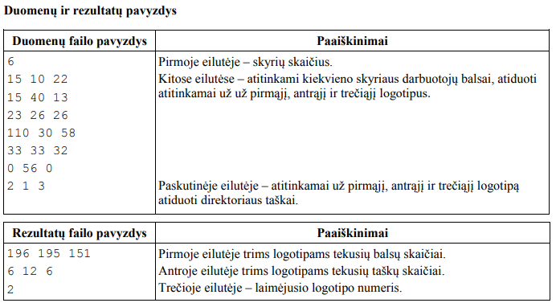

# Balsavimas
Įmonėje, sudarytoje iš keleto skyrių, renkamas vienas iš trijų logotipų. Parengtos tokios darbuotojų
apklausos taisyklės:<br/>

**1.** Kiekvienas skyriaus darbuotojas (išskyrus direktorių) atiduoda savo balsą už kurį nors vieną logotipą.<br/>

**2.** Atskirai kiekviename skyriuje suskaičiavus darbuotojų balsus, daugiausia balsų surinkusiam
logotipui skiriami keturi taškai, jei du geriausiai įvertinti logotipai surenka vienodai balsų – jiems
skiriama po du taškus, o jei balsai pasiskirsto po lygiai – taškų tame skyriuje neskiriama.<br/>

**3.** Atskirai susumuojami pirmo, antro ir trečio logotipų visuose skyriuose gauti taškai.<br/>

**4.** Jei du ar trys geriausi logotipai surenka po vienodai taškų, prie kiekvieno logotipo taškų sumos
pridedami direktoriaus skirti taškai. Direktorius vienam iš logotipų skiria 3 taškus, kitam – 2, o
likusiam – 1 tašką.<br/>

**5.** Nugali tas logotipas, kuris surenka daugiausia taškų.<br/>
Parašykite programą, kuri nustatytų:
* kiek iš viso balsų ir taškų gavo kiekvienas logotipas,<br/>
* kuris iš logotipų buvo išrinktas.<br/>

**Pradiniai duomenys**<br/>

Duomenys yra tekstiniame faile **U1.txt**:

* pirmoje eilutėje yra įmonės skyrių skaičius k (1<=k<=10) ,<br/>
* kitose k eilučių yra už pirmąjį, antrąjį ir trečiąjį logotipus kiekviename skyriuje skirti balsai,<br/>
* paskutinėje eilutėje yra už pirmąjį, antrąjį ir trečiąjį logotipą atiduoti direktoriaus taškai (trys
skirtingi skaičiai nuo 1 iki 3).<br/>

**Rezultatai**

Tekstiniame faile U1rez.txt rezultatus įrašykite tokia tvarka:<br/>

* pirmoje eilutėje trims logotipams tekusių balsų skaičiai,<br/>
* antroje eilutėje trims logotipams tekusių taškų skaičiai,<br/>
* trečioje eilutėje – laimėjusio logotipo numeris.<br/>

**Nurodymai**

* Parašykite taškų apskaičiavimo viename skyriuje procedūrą.<br/>
* Parašykite funkciją, nustatančią geriausią logotipą visoje įmonėje.<br/>
* Programoje nenaudokite sakinių, skirtų darbui su ekranu.<br/>




## Kaip kompiliuoti kodą
Parašius komandą ```make balsavimas``` į terminalą, kodas bus sukompiliuojamas. <br/>
Norint jį paleisti, reikia parašyti ```./balsavimas```. <br/>

## Kaip testuoti kodą
Parašykite šią komandą, kad paleisti check50 procesą
```check50 Kristupasc/uzduotys/master/Balsavimas```

## Kaip patikrinti kodo stilių
Parašykite šią komandą, kad paleisti style50 procesą
```style50 balsavimas.cpp```
<br/>
<br/>
<br/>
<br/>
<br/>
<br/>
