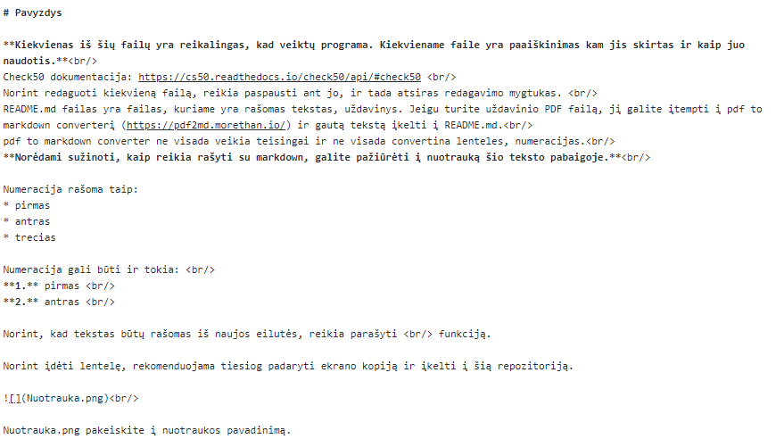
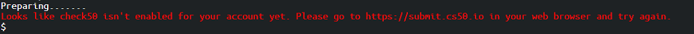

# Pavyzdys

**Pamoka kaip sukurti savo repozitoriją:** https://youtu.be/V9wYxBecvZ4  

**Kiekvienas iš šių failų yra reikalingas, kad veiktų programa. Kiekviename faile yra paaiškinimas kam jis skirtas ir kaip juo naudotis.** 
Check50 dokumentacija: https://cs50.readthedocs.io/check50/api/#check50  
Norint pažiūrėti, kas yra parašyta kiekviename faile, tiesiog ant jo paspauskite.  
README.md yra failas, kuriame yra rašomas tekstas, uždavinys. Jeigu turite uždavinio PDF failą, jį galite įtempti į pdf to markdown converterį (https://pdf2md.morethan.io/) ir gautą tekstą įkelti į README.md 
PDF to markdown converter ne visada veikia teisingai ir ne visada convertina lenteles, numeracijas. 
**Norėdami sužinoti, kaip reikia rašyti su markdown, galite pažiūrėti į nuotrauką šio teksto pabaigoje.** 

Numeracija rašoma taip: 
* pirmas 
* antras
* trecias

Numeracija gali būti ir tokia:  
**1.** pirmas  
**2.** antras   

Norint, kad tekstas būtų rašomas iš naujos eilutės, reikia parašyti   funkciją.

Norint įdėti lentelę, rekomenduojama tiesiog padaryti ekrano kopiją ir įkelti į šią repozitoriją.

 

Nuotrauka.png pakeiskite į nuotraukos pavadinimą.

Taip atrodo tekstas per markdown:

 

## Rekomendacijos
Yra rekomenduojama README.md gale įrašyti tekstą, kuris yra Rekomendacijos.txt faile.  

## Dažnai užduodami klausimai

**1. Rašant check50 komandą gaunu šią klaidą:**  
 
Nueikite į https://submit.cs50.io ir paspauskite authorize.
Jeigu vis tiek neveikia check50, tada:
* Palaukite apie 5-10 minučių.
* Pabandykite parašyti check50 komandą būdami naršyklės incognito režime.  

**2. Esu repozitorijos savininkas (-ė) ir neveikia check50 komanda** 
Šiuo atveju teks susikurti naują GitHub profilį, kurį reikės naudoti rašant check50 komandą.
